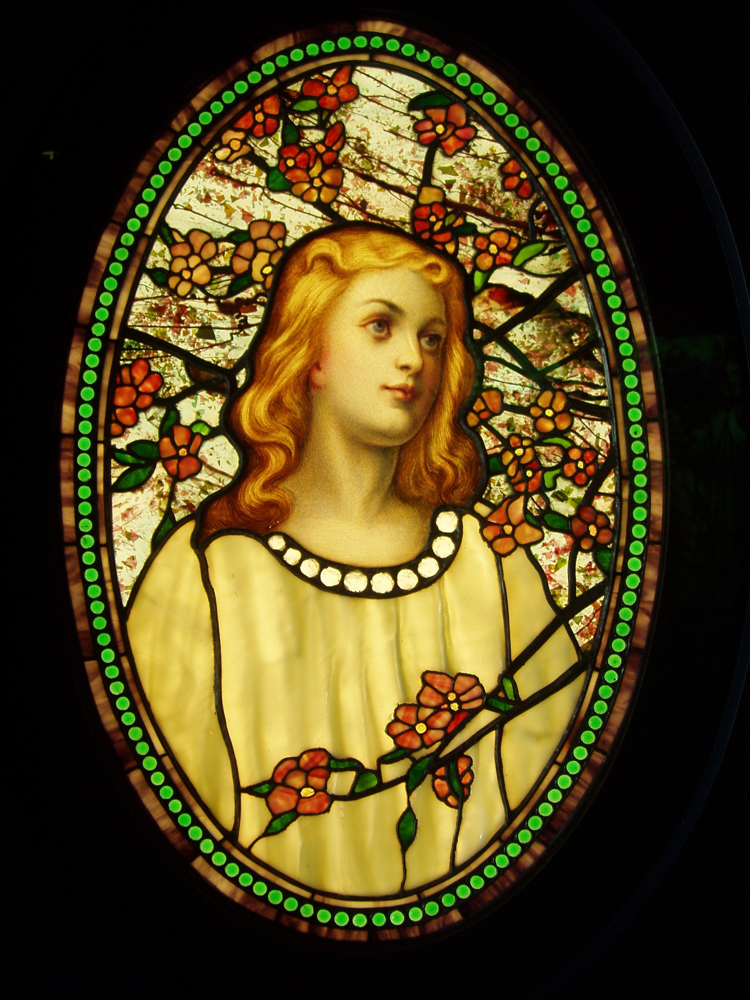

# babette_on_windows

Verify the babette R package works on Windows

## About the `babette_on_windows` logo

The image is from [Wikipedia](https://en.wikipedia.org/wiki/Tiffany_glass#/media/File:Girl_with_Cherry_Blossoms_-_Tiffany_Glass_&_Decorating_Company,_c._1890.JPG).
From there I quote:

> This work is in the public domain in its country of origin and other countries and areas where the copyright term is the author's life plus 70 years or less. 

